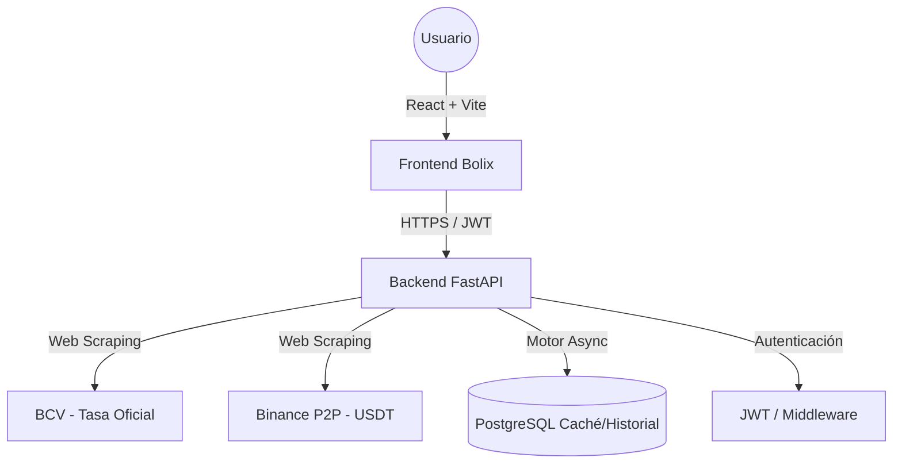

# 🚀 Ecosistema Bolix

<p align="center">
  
  
</p>

**Bolix** es un ecosistema de seguimiento financiero de alto rendimiento, diseñado específicamente para el mercado venezolano. Permite el monitoreo en tiempo real de la tasa de cambio entre el **Bolívar (VES)** y las principales divisas extranjeras (**USD**, **EUR**) y activos digitales (**USDT**).

El sistema integra datos en vivo del **Banco Central de Venezuela (BCV)** y **Binance P2P**, ofreciendo una visión integral de la brecha del mercado, tendencias históricas y herramientas de conversión inteligentes.

---

## ✨ Características Principales

### 📡 Inteligencia en Tiempo Real
*   **Monitoreo Dual**: Seguimiento simultáneo de las tasas oficiales del BCV y las tasas de mercado de Binance P2P (USDT).
*   **Análisis de Brecha**: Cálculo automático del diferencial porcentual entre la tasa oficial y la paralela para detectar volatilidad.
*   **Resiliencia Inteligente**: Lógica de scraping robusta con una capa de caché en PostgreSQL y fallback histórico, garantizando un tiempo de actividad del 99.9%.

### 🔐 Seguro y Personalizado
*   **Autenticación JWT**: Sistema seguro de registro e inicio de sesión.
*   **Perfiles de Usuario**: Gestión de sesiones para una experiencia personalizada.
*   **Historial de Auditoría**: Acceso a las últimas 20 actualizaciones de tasas para rastrear micro-tendencias.

### 🛠️ Herramientas Interactivas
*   **Calculadora Multimoneda**: Conversión instantánea entre VES, USD, EUR y USDT utilizando las tasas actuales.
*   **Notificaciones Push (En Desarrollo)**: Mantente informado con alertas en tiempo real sobre cambios significativos en las tasas.
*   **Registro de Trades**: Rastrea tus transacciones personales y monitorea tu balance de operaciones.

---

## 🏗️ Arquitectura Técnica



---

## 🛠️ Stack Tecnológico

### **Frontend (La Interfaz)**
*   **React 19**: Biblioteca de UI moderna para una experiencia de usuario reactiva.
*   **TypeScript**: Desarrollo robusto con tipado estático.
*   **Vite**: Herramienta de construcción y servidor de desarrollo ultra-rápido.
*   **Tailwind CSS**: Estilizado basado en utilidades para un diseño premium mobile-first.
*   **Lucide React**: Iconografía consistente y estética.

### **Backend (El Motor)**
*   **FastAPI**: Framework asíncrono de Python de alto rendimiento.
*   **SQLAlchemy (Async)**: ORM moderno para operaciones de base de datos eficientes.
*   **PostgreSQL**: Base de datos relacional confiable para caché e historial.
*   **BeautifulSoup4**: Análisis avanzado de HTML para la extracción de datos.

### **Infraestructura**
*   **Vercel**: Despliegue global para Frontend y Backend (Serverless).
*   **Railway**: Base de datos PostgreSQL alojada en la nube.

---

## 🚀 Endpoints de la API

| Categoría | Método | Endpoint | Descripción |
| :--- | :--- | :--- | :--- |
| **Núcleo** | `GET` | `/tasa` | Tasas actuales (BCV/Binance) con Caché. |
| **Datos** | `GET` | `/historial` | Historial reciente de actualizaciones. |
| **Sistema** | `GET` | `/status` | Salud del servidor, estado de DB y uptime. |
| **Seguridad**| `POST`| `/auth/login` | Autenticación de usuario. |
| **Finanzas** | `POST`| `/trades/registrar`| Registro de una nueva operación USDT. |
| **Finanzas** | `GET` | `/trades/balance/{id}`| Obtener conteo de operaciones del usuario. |

---

## ⚙️ Instalación y Configuración

### 1. Clonar el Repositorio
```bash
git clone https://github.com/CarlosSalazar34/Bolix.git
cd Bolix
```

### 2. Configuración del Backend
```bash
cd backend
python -m venv venv
source venv/Scripts/activate # En Linux: source venv/bin/activate
pip install -r requirements.txt
# Crear archivo .env con DATABASE_URL y ALLOWED_ORIGINS
uvicorn app.app:app --reload --port 5000
```

### 3. Configuración del Frontend
```bash
cd frontend
npm install
# Crear archivo .env con VITE_API_URL=http://localhost:5000
npm run dev
```

---

## 👥 Equipo de Desarrollo

| Desarrollador | Responsabilidad | Contacto |
| :--- | :--- | :--- |
| **Carlos Salazar** | Arquitecto Frontend y Diseñador UX | [@CarlosSalazar34](https://github.com/CarlosSalazar34) |
| **Gabriel Mejías** | Ingeniero Backend e Integrador | [@Gabbuvtt](https://github.com/Gabbuvtt) |

---

## 📄 Licencia
Este proyecto está bajo la **Licencia MIT**. Consulta el archivo [LICENSE](LICENSE) para más información.

---
<p align="center">Hecho con ❤️ para Venezuela 🇻🇪</p>