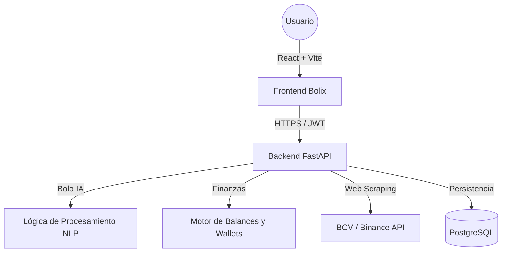

  
  

<h1 align="center">🚀 Ecosistema Bolix</h1>

  <strong>Seguimiento financiero de alto rendimiento para el mercado venezolano.</strong> 
  Dólar BCV · Euro BCV · USDT Binance P2P · Gestor de Gastos · Asistente IA

  
  

---

## 📖 Descripción

**Bolix** es un ecosistema financiero diseñado para centralizar y simplificar el monitoreo de la tasa de cambio entre el **Bolívar (VES)** y las principales divisas extranjeras (**USD**, **EUR**) y activos digitales (**USDT**). 

En su versión 1.3.0, Bolix ha evolucionado de un simple monitor a un **asistente financiero integral**, permitiendo a los usuarios gestionar sus cuentas bancarias, categorizar sus gastos diarios y recibir asesoría inteligente a través de **Bolo**, el primer asistente IA especializado en el mercado venezolano.

---

## ✨ Características Principales

### 🤖 Bolo: Asistente Inteligente
*   **Lenguaje Natural**: Registra tus compras y ventas simplemente hablándole a Bolo (ej: *"Compré 100 bolos"*, *"Vendí 50 USDT"*).
*   **Cálculo de Rendimiento**: Bolo analiza tu precio promedio de compra y te informa si vas ganando o perdiendo dinero según la tasa actual de Binance.
*   **Consultas Rápidas**: Obtén el precio del dólar al instante preguntándole *"¿A cuánto está la tasa?"*.

### 📊 Gestor de Finanzas (Gestor)
*   **Control de Gastos/Ingresos**: Sistema completo de registro categorizado (Alimentación, Salud, Ocio, etc.).
*   **Billeteras Multimoneda**: Crea y gestiona cuentas en BS, USD y USDT con saldos que se actualizan automáticamente con cada movimiento.
*   **Conversión Dinámica**: Al registrar gastos en divisas, el sistema calcula automáticamente el equivalente en Bolívares basado en la tasa seleccionada (BCV, Binance o Promedio).

### 📡 Inteligencia en Tiempo Real
*   **Monitoreo Dual**: Seguimiento simultáneo de tasas oficiales (BCV) y mercado paralelo (Binance P2P).
*   **Análisis de Brecha**: Cálculo automático del diferencial porcentual para detectar volatilidad instantánea.
*   **Diseño Premium**: Interfaz moderna con efectos de *glassmorphism*, animaciones fluidas y modo oscuro nativo.

---

## 🏗️ Arquitectura Técnica

---

## 🛠️ Stack Tecnológico

### **Frontend**
| Tecnología | Uso |
| :--- | :--- |
|  | Librería de UI moderna para una experiencia reactiva. |
|  | Desarrollo robusto con tipado estático. |
|  | Estilizado premium y diseño responsive. |

### **Backend**
| Tecnología | Uso |
| :--- | :--- |
|  | Framework asíncrono de alto rendimiento. |
|  | ORM para gestión avanzada de modelos y relaciones. |
|  | Validación de datos y esquemas de API. |

---

## 🚀 API Endpoints (Nuevos)

| Categoría | Método | Endpoint | Descripción |
| :--- | :--- | :--- | :--- |
| **Chatbot** | `POST` | `/chatbot/consultar` | Procesa mensajes naturales y ejecuta órdenes financieras. |
| **Gestor** | `GET` | `/gestor/records` | Obtiene el historial de ingresos y gastos categorizados. |
| **Gestor** | `POST`| `/gestor/records` | Registra un movimiento y actualiza el saldo de la wallet. |
| **Wallets** | `GET` | `/wallets` | Lista las cuentas del usuario con sus saldos en tiempo real. |

---

## 👥 Equipo de Desarrollo

| Desarrollador | Responsabilidad | GitHub |
| :--- | :--- | :--- |
| **Carlos Salazar** | Arquitecto Frontend & Diseño UX | [@CarlosSalazar34](https://github.com/CarlosSalazar34) |
| **Gabriel Mejías** | Ingeniero Backend & Lógica de Datos | [@Gabbuvtt](https://github.com/Gabbuvtt) |

---

## 📄 Licencia
Este proyecto está bajo la **Licencia MIT**. Consulta el archivo [LICENSE](LICENSE) para más información.

Hecho con ❤️ para Venezuela 🇻🇪
