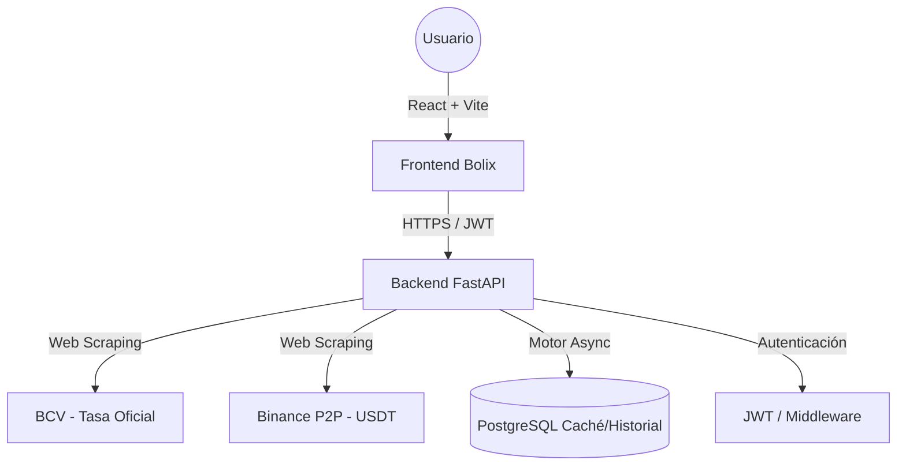

<p align="center">
  
  
</p>

<h1 align="center">🚀 Ecosistema Bolix</h1>

<p align="center">
  <strong>Seguimiento financiero de alto rendimiento para el mercado venezolano.</strong><br/>
  Dólar BCV · Euro BCV · USDT Binance P2P
</p>

<p align="center">
  <a href="https://bolix-five.vercel.app">
    
  </a>
  <a href="https://bolix-backend.vercel.app">
    
  </a>
  
</p>

---

## 📖 Descripción

**Bolix** es un ecosistema financiero diseñado para centralizar y simplificar el monitoreo de la tasa de cambio entre el **Bolívar (VES)** y las principales divisas extranjeras (**USD**, **EUR**) y activos digitales (**USDT**).

El sistema utiliza técnicas avanzadas de **Web Scraping** para extraer datos en vivo del **Banco Central de Venezuela (BCV)** y **Binance P2P**, procesándolos para ofrecer indicadores críticos como la brecha cambiaria y promedios de mercado, todo bajo una interfaz moderna y reactiva.

---

## ✨ Características Principales

### 📡 Inteligencia en Tiempo Real
*   **Monitoreo Dual**: Seguimiento simultáneo de tasas oficiales (BCV) y mercado paralelo (Binance P2P).
*   **Análisis de Brecha**: Cálculo automático del diferencial porcentual para detectar volatilidad instantánea.
*   **Resiliencia Inteligente**: Motor de scraping robusto con capa de caché en PostgreSQL y fallback histórico para asegurar disponibilidad total.

### 🔐 Seguridad y Auditoría
*   **Autenticación JWT**: Registro e inicio de sesión seguros para acceso a funciones privadas.
*   **Historial de Auditoría**: Rastreo cronológico de las últimas 20 actualizaciones de tasas.
*   **Notificaciones Push**: Sistema de alertas integradas para cambios significativos en el mercado.

### 🛠️ Herramientas de Usuario
*   **Calculadora Inteligente**: Conversión instantánea entre VES, USD, EUR y USDT basada en tasas vivas.
*   **Gestión de Trades**: Registro y monitoreo de transacciones personales para control financiero.
*   **Diseño Mobile-First**: Interfaz premium optimizada para una experiencia fluida en cualquier dispositivo.

---

## 🏗️ Arquitectura Técnica



---

## 🛠️ Stack Tecnológico

### **Frontend**
| Tecnología | Uso |
| :--- | :--- |
|  | Librería de UI moderna para una experiencia reactiva. |
|  | Desarrollo robusto con tipado estático. |
|  | Herramienta de construcción y servidor ultra-rápido. |
|  | Estilizado premium y diseño responsive. |

### **Backend**
| Tecnología | Uso |
| :--- | :--- |
|  | Lenguaje principal para procesamiento de datos. |
|  | Framework asíncrono de alto rendimiento. |
|  | Base de datos para caché, historial y auditoría. |
|  | Motor de extracción para BCV y fuentes externas. |

### **Infraestructura**
| Servicio | Uso |
| :--- | :--- |
|  | Hosting escalable para Frontend y Backend. |
|  | Base de datos PostgreSQL gestionada en la nube. |

---

## 🚀 API Endpoints

| Categoría | Método | Endpoint | Descripción |
| :--- | :--- | :--- | :--- |
| **Núcleo** | `GET` | `/tasa` | Tasas actuales (BCV/Binance) con optimización de caché. |
| **Datos** | `GET` | `/historial` | Registro histórico de actualizaciones de mercado. |
| **Sistema** | `GET` | `/status` | Estado del servidor, conexión a DB y uptime. |
| **Seguridad**| `POST`| `/auth/login` | Inicio de sesión y generación de tokens JWT. |
| **Finanzas** | `POST`| `/trades/registrar`| Registro de operaciones personales de compra/venta. |
| **Finanzas** | `GET` | `/trades/balance/{id}`| Resumen de operaciones y balance del usuario. |

---

## ⚙️ Configuración Local

### 1. Clonar el Repositorio
```bash
git clone https://github.com/CarlosSalazar34/Bolix.git
cd Bolix
```

### 2. Backend
```bash
cd backend
python -m venv venv
source venv/Scripts/activate # Linux/macOS: source venv/bin/activate
pip install -r requirements.txt
# Configurar archivo .env con DATABASE_URL y JWT_SECRET
uvicorn app.app:app --reload --port 5000
```

### 3. Frontend
```bash
cd frontend
npm install
# Configurar archivo .env con VITE_API_URL=http://localhost:5000
npm run dev
```

---

## 👥 Equipo de Desarrollo

| Desarrollador | Responsabilidad | GitHub |
| :--- | :--- | :--- |
| **Carlos Salazar** | Arquitecto Frontend & Diseño UX | [@CarlosSalazar34](https://github.com/CarlosSalazar34) |
| **Gabriel Mejías** | Ingeniero Backend & Lógica de Datos | [@Gabbuvtt](https://github.com/Gabbuvtt) |

> *Este proyecto es el resultado de un esfuerzo colaborativo enfocado en la excelencia técnica. Agradecimiento especial a **Gabriel Mejías** por el desarrollo de la arquitectura del backend.*

---

## 📄 Licencia
Este proyecto está bajo la **Licencia MIT**. Consulta el archivo [LICENSE](LICENSE) para más información.

<p align="center">Hecho con ❤️ para Venezuela 🇻🇪</p>